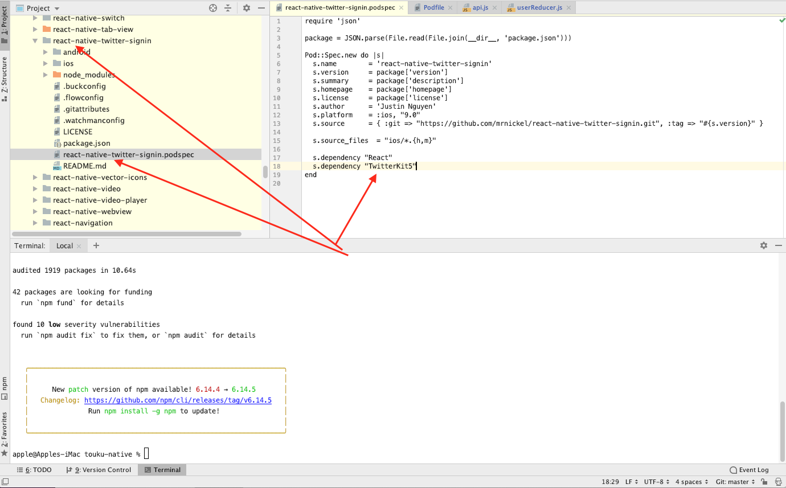

# touku-native

## After npm install

### To enable login with line

- copy LineLogin.java from ./LineLibChanges and replace it with ./node_modules/react-native-line-sdk/android/src/main/java/com/xmartlabs/lineloginmanager/LineLogin.java
- copy strings.xml from ./LineLibChanges and replace it with ./node_modules/react-native-line-sdk/android/src/main/res/values/strings.xml

### To fix webview error in android

- comment "import com.facebook.react.views.webview.ReactWebViewManager" line 12 in ./node_modules/react-native-doc-viewer/android/src/main/java/com/reactlibrary/RNReactNativeDocViewerModule.java

### To fix pod install issue (target has frameworks with conflicting names: twitterkit.framework.)

- update (s.dependency "TwitterKit", "~> 3.3") to (s.dependency "TwitterKit5") in ./node_modules/react-native-twitter-signin/react-native-twitter-signin.podspec as show in image below.

### Phone field customisation

- Update onChangePhoneNumber from ./node_modules/react-native-phone-input/lib/index.js to

onChangePhoneNumber(number) {
this.props.onChangePhoneNumber(number);
// const actionAfterSetState = this.props.onChangePhoneNumber
// ? () => {
// this.props.onChangePhoneNumber(number);
// }
// : null;
// this.updateFlagAndFormatNumber(number, actionAfterSetState);
}

### [iOS] Fixes TextInput Text Rendering Issue when typing Japanese, Chinese etc

Update only the lines with the + operator at the start of them

-Goto ./node_modules/react-native/Libraries/Text/TextInput/Multiline/RCTUITextView.m

(void)setDefaultTextAttributes:(NSDictionary<NSAttributedStringKey, id> \*)defaultTextAttributes
{

- if ([_defaultTextAttributes isEqualToDictionary:defaultTextAttributes]) {
- return;
- }
  \_defaultTextAttributes = defaultTextAttributes;
  self.typingAttributes = defaultTextAttributes;
  [self _updatePlaceholder];

-Goto ./node_modules/react-native/Libraries/Text/TextInput/Singleline/RCTUITextField.m

(void)setDefaultTextAttributes:(NSDictionary<NSAttributedStringKey, id> \*)defaultTextAttributes
{

- if ([_defaultTextAttributes isEqualToDictionary:defaultTextAttributes]) {
- return;
- }
  \_defaultTextAttributes = defaultTextAttributes;
  [super setDefaultTextAttributes:defaultTextAttributes];
  [self _updatePlaceholder];

### To fix crash on android specific devices on launch

- Update build.gradle of react-native-twitter-signin, react-native-doc-viewer, react-native-orientation, and react-native-line-sdk modules
  Go to the ./node_module/moduleName/android/build.gradle and replace the compileSdkVersion, buildToolsVersion, minSdkVersion, and targetSdkVersion to your compileSdkVersion, buildToolsVersion, minSdkVersion, and targetSdkVersion of main build.gradle. For going to your build.gradle, go to android/build.gradle

### To properly use Mentions Functionality

- Please replace the file from\LineLibChanges\react-native-mentions to \node_modules\react-native-mentions\src

### To upload gif image

- copy ImageCropPicker.m from ./LineLibChanges/react-native-image-crop-picker/ImageCropPicker.m and replace it with ./node_modules/react-native-image-crop-picker/ios/src/ImageCropPicker.m

### Fix image not visible issue in iOS 14
- Replace displayLayer method from ./node_module/react-native/Libraries/Image/RCTUIImageViewAnimated.m

from this: 
- (void)displayLayer:(CALayer *)layer 
 { 
   if (_currentFrame) { 
     layer.contentsScale = self.animatedImageScale; 
     layer.contents = (__bridge id)_currentFrame.CGImage; 
   } 
 } 
 
 to this:
 
 - (void)displayLayer:(CALayer *)layer 
  { 
    if (_currentFrame) { 
      layer.contentsScale = self.animatedImageScale; 
      layer.contents = (__bridge id)_currentFrame.CGImage; 
    } else {
           [super displayLayer:layer];
         }
  } 
